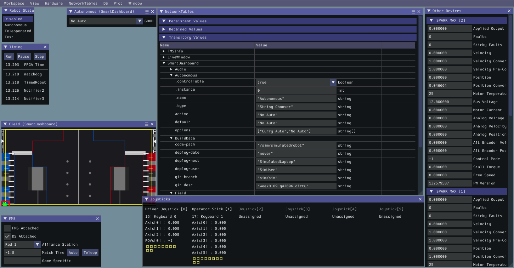
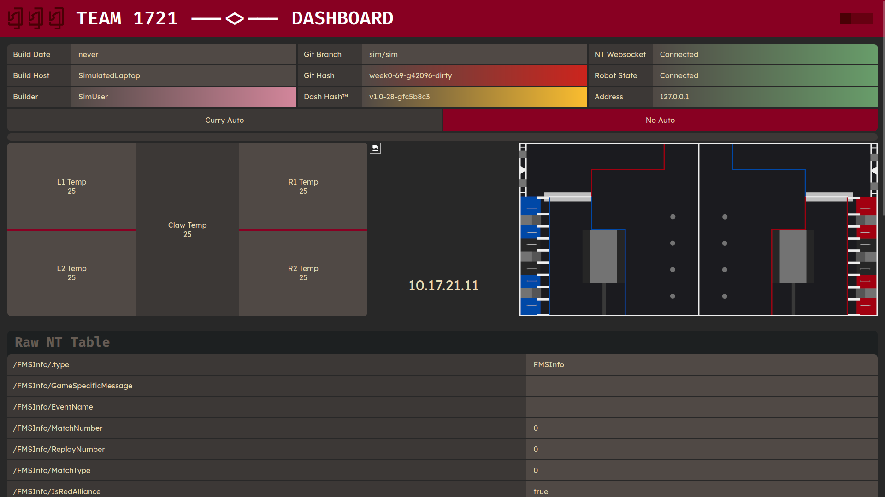

Developing
##########

.. include:: ../resources/resources.rst

Configuration Files
===================

|pitcrew| |software|

This is literally the robot hardware configuration written in yaml.

These are provided as reference for use by pit crew.

Use this to confirm/reconfigure motor controller addresses or examine
if pose x/y cords match actual.

.. literalinclude:: ../../rio/constants/robot_hardware.yaml
  :language: YAML

   A programmer in his natural habitat

Modifying these docs
====================

|software|

Requirements for building the docs
----------------------------------

You'll need to install several packages to build these docs

.. code-block:: shell
   
   # Ubuntu/Debian users
   sudo apt install texlive-latex-recommended texlive-latex-extra texlive-pictures pandoc rename latexmk

   # Arch/Manjaro users
   pacman -S texlive-pictures pandoc latexmk

Making the docs
---------------

Under the ``Docs`` directory in ``1721-ChargedUp``, setup a pipenv using the 
provided files and invoke the ``make latexpdf`` command to build the docs.

.. code-block:: shell

   pipenv install # May take a while
   pipenv shell
   make latexpdf # Builds the manual

Find the generated ``.pdf`` under ``docs/_build/latex/``
it is recommended that you also have a restructured text interpreter such as reStructuredText.
Documentation for sphinx can be found `here <https://sublime-and-sphinx-guide.readthedocs.io/en/latest/setup.html>`_

Using Github
============

|software|

We use `Github <https://github.com>`_ as our main version
control and automation system, paired with github actions and our
own jenkins build server in the build space.

Making Pull requests
--------------------

While you will mostly interact with github through git you should know how to make pull requests.

First go to the current `repo 1721 ChargedUp <https://github.com/FRC-1721/1721-ChargedUp/tree/main>`_.

You first under the pull requests tab create a new pull request,
select the branch you want to make the pull request for.

Once approved by someone with proper clearance (Keegan or Joe) you may merge it,
please **squash and merge** to not have billions of commits in main.

Creating Issues
---------------

This will go over creating github issues, github issues
are one way we communicate what needs to be done.

On the issues tab there will be a button saying *New issue*,
click that and enter the information about the issue.

Making and Adding Labels and Milestones
---------------------------------------

Labels and Milestones are a nice way to categorize issues and pull requests,
they both can created and added the same way.

To create a Label or Milestone on the main page of issues or pull requests there are buttons,
saying *Labels* and *Milestones*.

After pressing input a name and a description, github uses a hex system for colors
to help select a color use `this <https://www.color-hex.com/>`_.

Robot Simulator
===============

|software|

Requirements
------------

Under the ``rio`` directory setup a pipenv using the provided files
and invoke the ``make sim`` command to run the simulator.

.. code-block:: shell
   
   pipenv install # May take a while
   pipenv shell
   make sim # Alternatively run: python3 robot.py sim

This will start the robot simulator. See :ref:`Using the Simulator` for more info.

Using the Simulator
-------------------

To be able to "operate" the robot while any mode will work it 
is recommended that under robot state, Teleoperated is enabled.

Under the Joysticks there will be Joysticks 1-5 all grayed out,
to select one go to System Joysticks and drag on over.

When starting up the program there will be no input method
selected under System Joysticks there may be Joysticks,
Xbox controllers, or Keyboards 0-3.

Joysticks and Xbox controllers work as if piloting an actual robot,
to find layouts for controls see :ref:`Controller Map`.

Keyboard 0 is the WASD keys to move and E and R to rotate the controller
buttons 1 through 4 can be access by Z,X,C,V in that order.

Keyboards 1-3 are differing controller schemes that are useless for 
the purposes of testing due to lack of movement.

Keyboard inputs require you to have the active window be the simulator 
while, Joysticks and xbox controllers don't.

Dashboard
=========

|software| |driveteam|

Dashboard Requirements
----------------------

Under the ``dashboard`` directory setup a pipenv using the provided files
and invoke the ``make run`` command to start the Dashboard's local host.

.. code-block:: shell

   pipenv install # May take a while
   pipenv shell
   make run # makes a locally hosted website dashboard

This will start the website dashboard. See :ref:`Using the Dashboard` for more info.

Using the Dashboard
-------------------

Activating the dashboard doesn't automatically start. To start the Dashboard within your terminal it will print

.. code-block:: shell

   cd www && python -m pynetworktables2js
   16:32:28:683 INFO    : dashboard           : Connecting to NetworkTables at Ip address
   16:32:28:683 INFO    : nt                  : NetworkTables initialized in client mode
   16:32:28:683 INFO    : dashboard           : NetworkTables Initialized
   16:32:28:684 INFO    : dashboard           : Listening on http://localhost:5800/
   16:32:28:978 INFO    : tornado.access      : 101 GET /networktables/ws (Ip address) 0.89ms
   16:32:28:978 INFO    : net2js              : NetworkTables websocket opened

Within this you will see one called local host, you will need to copy that link and put it in a web browser.
It is recommend that you use this in incognito due to network cache causing issues with not updating.

.. remember to update png as software is updated ..

This will auto connect to the simulation if one is running, if
you start one after remember to refresh the page.

For this station to active things such as the swerve drive wheels,
the simulation must be set to Teleoperated see :ref:`Using the Simulator`.

Robot code
==========

|software|

Deploying code
--------------

First remember to have the :ref:`FRC Driver Station` open first otherwise this won't work properly.

To deploy robot code first go to the ``rio`` setup a pipenv
and invoke the ``make deploy``, always run the :ref:`Robot Simulator` on code before deploying!

.. code-block:: shell

   pipenv install # this may take some time
   pipenv shell
   make deploy # this run python3 robot.py deploy

First time running it will ask for a team number (1721). After the first time it will
know the team number deploy the code.

FRC Driver Station
------------------

  Q driver Station

The FRC Driver Station is made for windows, but there is a linux version 
Q Driver Station.

This will assume your using the windows version but they both mostly the same.

Most of this won't be in your control during competitions, but this 
will go over it all.

The base mode is Teleoperated but you can also set it to Autonomous, practice, and test.

Autonomous will simulate code that would be run in Autonomous.
Practice will simulate competition timings, for testing use Teleoperated or in sim, see :ref:`Robot Simulator`.
Test, tests the code a better way to test is :ref:`Robot Simulator`.

You can enable the robot after a joystick is detected, make sure to plug one 
in, it has robot code, and has communications with the robot.

Also see :ref:`Dashboard` for how to use the dashboard.
