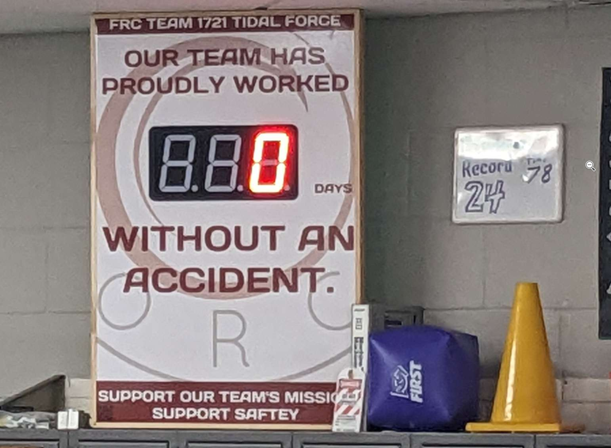

Introduction
============

.. include:: ../resources/resources.rst

|outreach|

.. warning::
   Make sure this manual's revision hash and the robot hash match!

  `Accident Counter <https://github.com/FRC-1721/AccidentCounter>`_

This is the official Robot Manual for Tidal Force FRC Team 1721's 2023 robot, `Rotom Toaster <https://github.com/FRC-1721/1721-ChargedUp>`_.
For the FRC Game `Charged Up <https://firstfrc.blob.core.windows.net/frc2023/Manual/2023FRCGameManual.pdf>`_!

This manual contains technical diagrams, prototyping processes and in depth technical
descriptions of all robot functions, from software to hardware and the messy bits in-between.

If you're really that interested to know all the details, you'll find them here!
