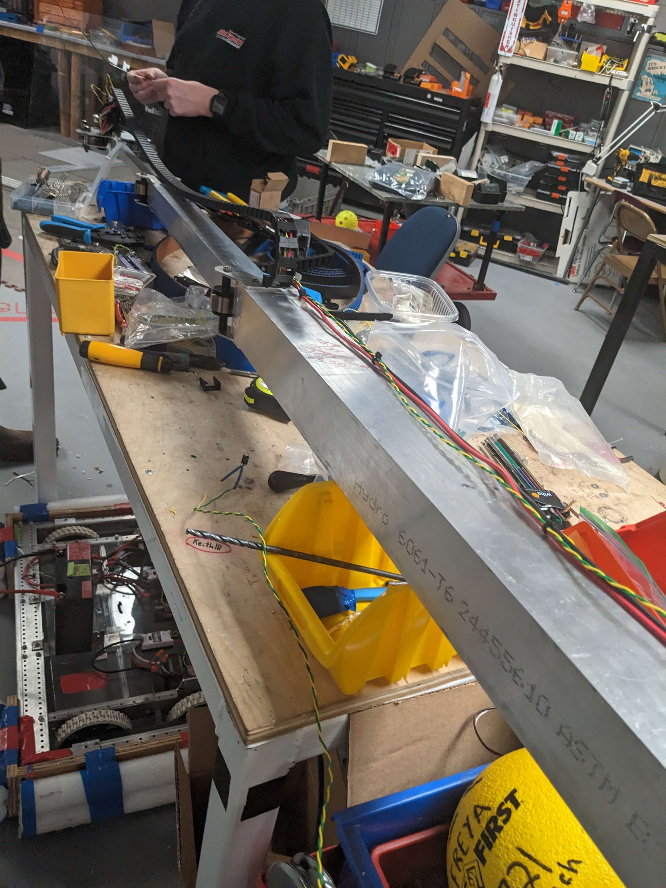
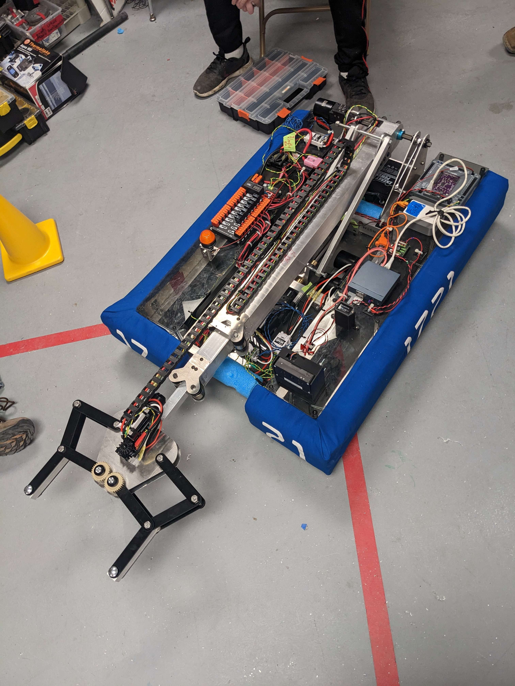
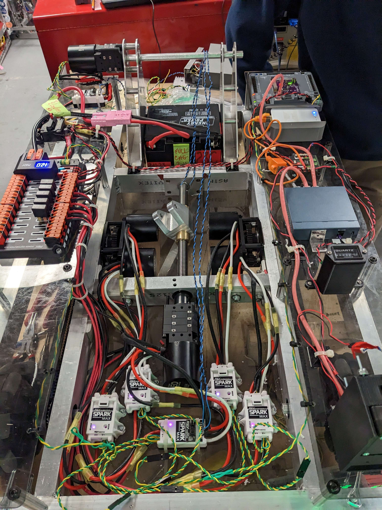

The Arm
#######

.. include:: ../resources/resources.rst

Introduction
============

|outreach|

  The arm during construction

The arm is a 3 stage nested tube stock assembly powered by springs. Its a design we've become familiar with.
It is powered by a pair of Rev NEO motors. One for its angle, and another for its extension.

The angle is determined by a lead screw and lifting arm assembly so as to avoid excessive motor load and precise
location tuning.

  A close up of the lead screw

Software
=========

|software|

The arm is driven using the embedded PID loops on both its motors. Limit switches limit its maximum extents
to protect the robot from damage.

Config Files
------------

.. literalinclude:: ../../rio/constants/robot_hardware.yaml
  :lines: 31-41
  :language: YAML

.. literalinclude:: ../../rio/constants/robot_pid.yaml
  :lines: 20-31
  :language: YAML

