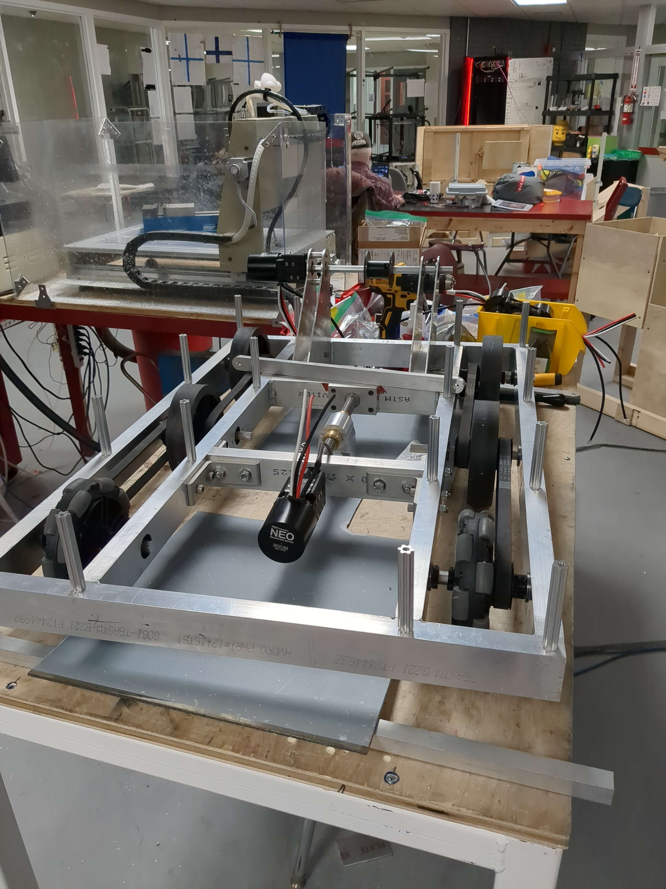
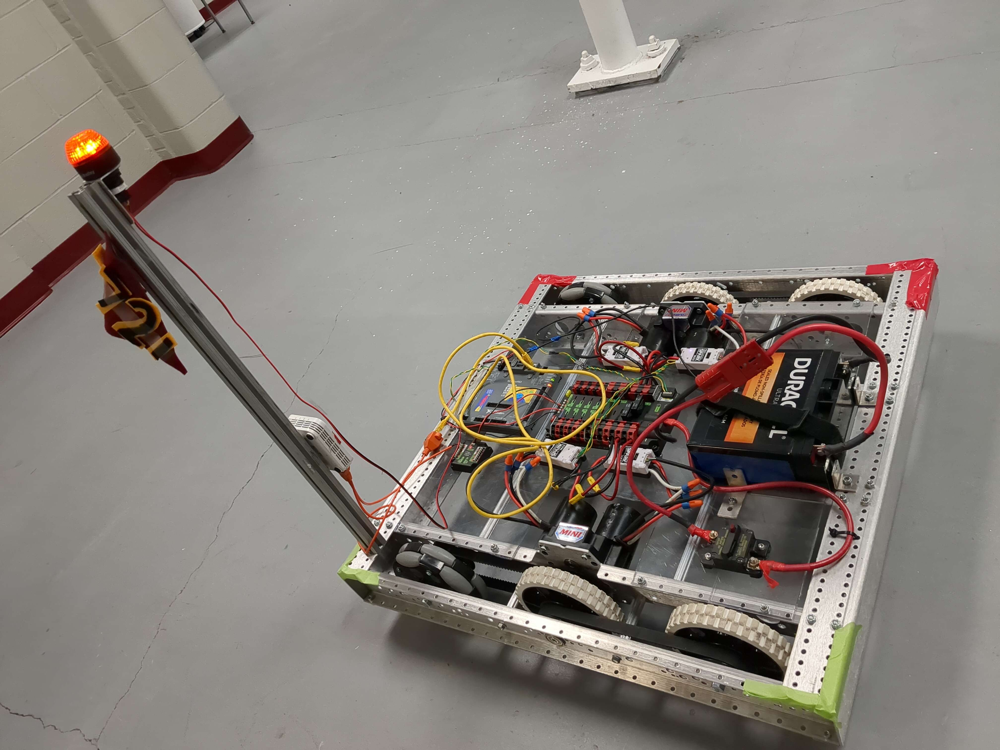

The Drivetrain
##############

.. include:: ../resources/resources.rst

Introduction
============

|outreach|

  The drivetrain during construction

The tank drivetrain is tried and tested, even by us! During :ref:`Prototyping` we 
experimented with our kitbot drivetrain and used it as a solid base to train new members
with. 

The drivetrain is a 3x3 tank drive base, with all wheels powered, and the first two being omnidirectional.

The drivetrain's top speed is estimated to be 45kts. Although it has not yet been in wide enough area to confirm.

Prototyping
===========

|outreach|

  The kitbot/prototype drivetrain.

In the pre season we prototyped using our kitbot and counterweights.

Software
=========

|software|

The drive base uses simple two wheel steering kinematics and an odometry with encoders, gyro and 
accelerometers to detect robot position.

Config Files
------------

.. literalinclude:: ../../rio/constants/robot_hardware.yaml
  :lines: 6-30
  :language: YAML

.. literalinclude:: ../../rio/constants/robot_pid.yaml
  :lines: 3-18
  :language: YAML

